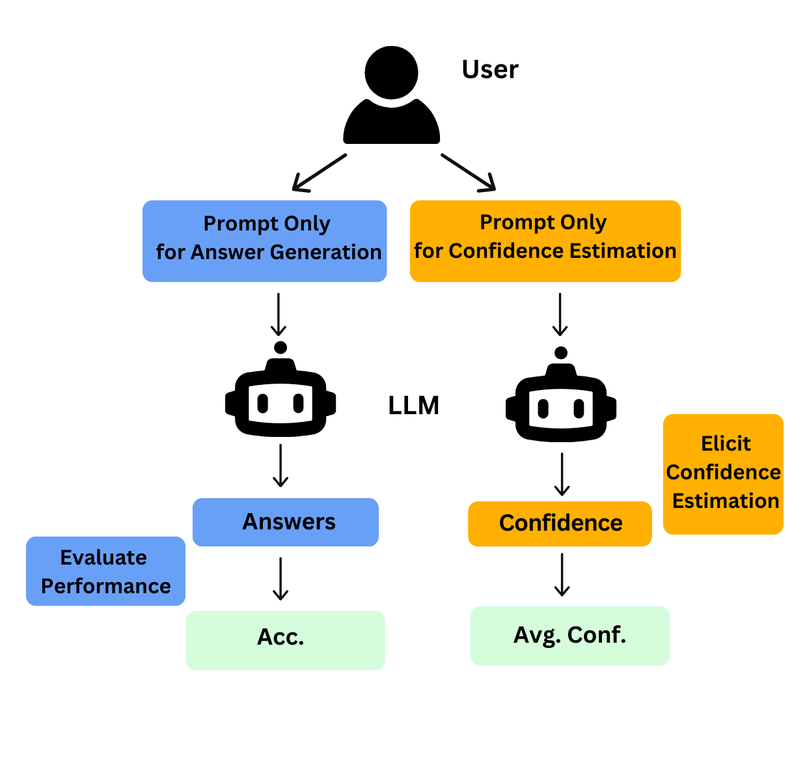

# Do Language Models Mirror Human Confidence? Exploring Psychological Insights to Address Overconfidence in LLMs 

This repository contains the datasets and code for our paper "Do Language Models Mirror Human Confidence? Exploring Psychological Insights to Address Overconfidence in LLMs"



## Datasets

If you just want to explore our experiment dataset. We provide a simple json version of the dataset `./Data`. The format for each 
task is as follows:

**Multiple Choices Questions**
1. **MMLU:** The dataset is cleaned and formatted as: [[question],[A],[B],[C],[D],[answer]] (The order of data is shuffled)
2. **GPQA:** The dataset is cleaned and formatted as: [[question],[A],[B],[C],[D],[answer]] (The order of data is shuffled)

**Open Questions**
1.  **NQ-open:** Coming soon.
2. **SimpleQA:** Coming soon.

## Click and Run Inference using our methods

We have created a simple click-and-run example for how to use AFCE on MMLU, GPQA, SimpleQA, and NQ-open. The code is in `./AFCE`.
In order to run our code, you first need to install environment from `./ModelTraining/environment.yml`.
For different tasks, the `runscript.sh` file contains instructions to run the experiments:

**Overconfidence**
1. AFCE: `AFCE.py`
2. Quiz-like: `quiz_like.py`
3. Top-k: `top_k.py`
4. Verbalized Confidence method (Vanilla): `vanilla.py`
5. Sampling based method: `sampling.py`
6. Probability based method: Coming soon

**Overplacement**
1. Overplacement: `overplacement.py`

**Demographic groups**
1. Demographic groups: `demographic.py`

**Ablation Study**
1. Number of questions: You can adjust the number via the `questions_per_quiz` parameter in `AFCE.py`.
2. Question order: You can change the order of questions by shuffling the dataset and then running `AFCE.py`.


## 🔧 Usage

Install dependencies before running:

```bash
pip install -r requirements.txt
```

Fill in API keys into `llm_api_utils.py`
```
# Replace with your actual API key
GROQ_API_KEY = ''
ANTHROPIC_API_KEY = ''
OPENAI_API_KEY = ''  
DEEP_SEEK_API_KEY = ''
```


To run the AFCE method on a dataset (e.g., MMLU) using GPT-4, use the following command:

```bash
python3 afce/AFCE.py \
  --datasets "college_physics" \
  --output_dir "results/" \
  --model "gpt-4o"
```
## Acknowledgement
We thank the anonymous reviewers for their feedback on our paper.

## Citation information

If you use this code, please cite our paper:

```
@misc{xu2025llmconfidence,
  title={Do Language Models Mirror Human Confidence? Exploring Psychological Insights to Address Overconfidence in LLMs},
  author={Chenjun Xu, Bingbing Wen, Bin HAN, Robert Wolfe, Lucy Lu Wang, Bill Howe},
}
```
